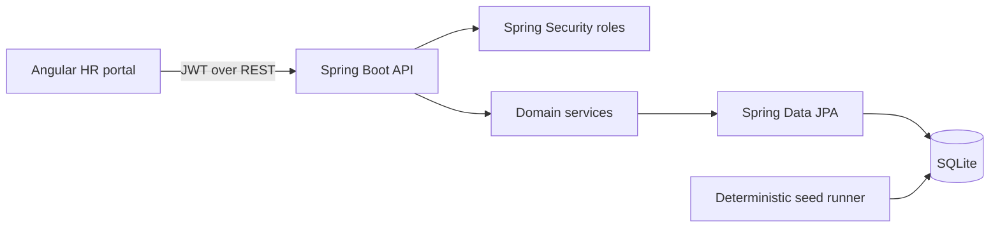

# Architecture

## Components

- `frontend`: Angular standalone application with route guards, an HTTP interceptor, forms, dashboard, employee list, and responsive styling.
- `backend`: Spring Boot REST API. Controllers define HTTP contracts, services hold business rules, repositories own persistence, and DTOs keep entities out of the API.
- `SQLite`: relational local/demo database. The schema is created by Hibernate and seeded once when empty.

## API shape

- `POST /api/auth/login` authenticates a username and password.
- `GET /api/employees` supports `search`, `country`, `department`, `active`, `page`, and `size`.
- `POST /api/employees`, `PUT /api/employees/{id}`, and `DELETE /api/employees/{id}` require `ADMIN` or `HR_MANAGER`.
- `GET /api/dashboard/summary` returns headcount and grouped salary metrics.
- `GET /actuator/health` supports deployment health checks.

## Authorization

The API uses short-lived stateless JWTs. `VIEWER` can read data; `HR_MANAGER` can read and change employee data; `ADMIN` also represents an administrative account for future user-management features. Public registration is intentionally absent.

## Data flow

List requests are filtered and paginated in the database. Writes pass through bean validation and a service-level duplicate check. Dashboard totals use grouped SQL projections so the 10,000-row seed is not loaded into the browser.
