# System Architecture

## Purpose and Scope

ACME Salary Management is a modular full-stack web application for authenticated staff to maintain employee compensation records and inspect workforce metrics. This document describes the implemented high-level design (HLD) and low-level design (LLD). The feature contracts under [specs](../specs/README.md) remain the source of truth for behavior.

The baseline supports one organization, three roles, 10,000 seeded employees, browser-based access, and a disposable demonstration deployment. Payroll processing, currency conversion, audit history, SSO, multi-tenancy, and production-grade persistence are outside scope.

---

# High-Level Design

## System Context

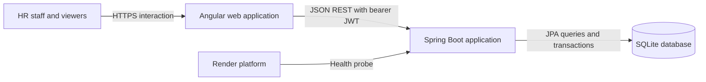

The browser is the only user-facing client. It communicates with a stateless REST API. Spring Boot serves both the API and production Angular assets, while SQLite stores users and employee records.

## Architectural Style

The application is a modular monolith with two build-time modules and one runtime service:

| Layer | Technology | Responsibility |
| --- | --- | --- |
| Presentation | Angular 18, Angular Material | Routes, forms, tables, dashboard, session UX |
| API | Spring Web MVC | HTTP contracts, validation entry points, response codes |
| Security | Spring Security, JJWT | Authentication, JWT validation, role enforcement |
| Domain | Spring services | Employee rules, duplicate checks, dashboard assembly |
| Persistence | Spring Data JPA, Hibernate | Entities, repositories, paging, grouped queries |
| Data store | SQLite | Users and employee compensation records |
| Operations | Actuator, Docker, Render | Health, packaging, configuration, deployment |

This structure favors straightforward ownership and deployment over distributed-service complexity.

## Container and Deployment View

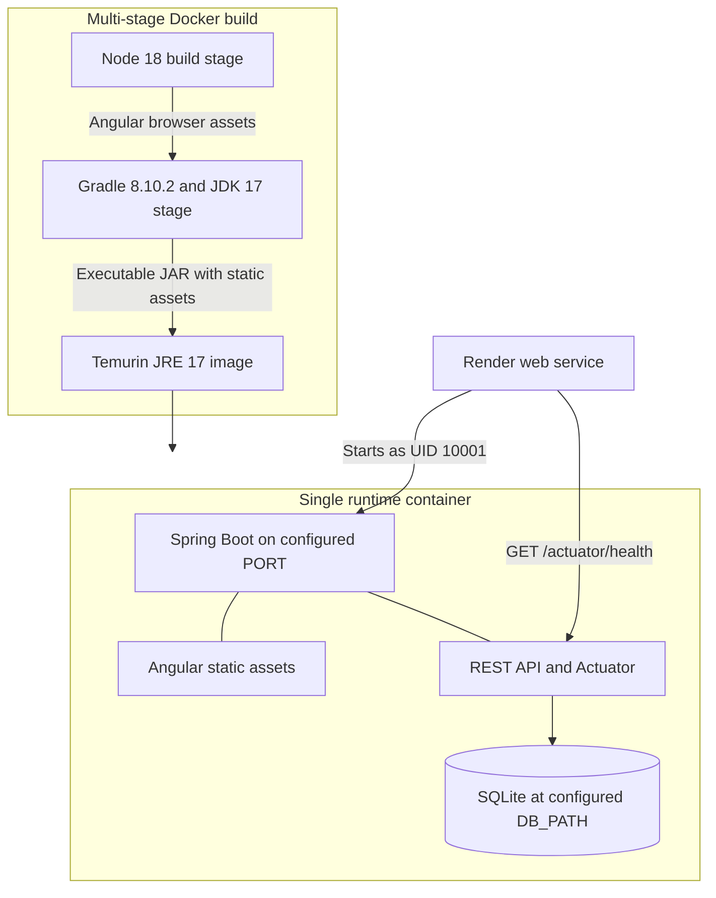

Local development runs Angular and Spring Boot separately, using the Angular proxy for `/api`. The production image copies the Angular browser build into Spring Boot static resources and runs the Java process as non-root user `appuser` with UID `10001`.

## Major Components

| Component | Responsibilities | Dependencies |
| --- | --- | --- |
| Angular application shell | Navigation, role-aware commands, router outlet | Auth service, Angular Router |
| Authentication feature | Login, browser session, route guard, bearer interceptor | Auth API, session storage |
| Employee feature | Search, filters, sorting, paging, create, edit, delete | Employee API |
| Dashboard feature | Summary cards and grouped workforce/pay metrics | Dashboard API |
| Spring security boundary | Public/protected route policy, JWT filter, method authorization | User repository, JWT service |
| Employee domain | Validation mapping, uniqueness, CRUD, database search | Employee repository |
| Dashboard domain | Counts, averages, currency totals, grouped headcounts | Employee repository |
| Seed subsystem | Demo identities and deterministic employee baseline | User and employee repositories |
| SPA delivery | Static resources and fallback routes | Packaged Angular output |
| Operational boundary | Configuration, health probes, graceful shutdown | Spring configuration, Actuator |

## Trust Boundaries and Security

```mermaid
flowchart LR
  Anonymous[Anonymous browser]
  Session[Authenticated browser session]
  Public[Public boundary]
  Jwt[JWT authentication filter]
  Protected[Protected API boundary]
  Method[Method authorization]
  Domain[Domain services]

  Anonymous -->|SPA, login, health| Public
  Anonymous -->|Credentials| Public
  Public -->|Signed JWT| Session
  Session -->|Bearer token| Jwt
  Jwt -->|Valid enabled user| Protected
  Protected --> Method
  Method -->|Authorized role| Domain
```

Public resources are the SPA, `/api/auth/**`, and `/actuator/health`. Employee reads and dashboard metrics require authentication. `ADMIN` and `HR_MANAGER` can create or update employees; only `ADMIN` can delete. UI visibility improves usability but is not a security boundary. The backend remains authoritative.

Passwords are BCrypt hashes. JWT expiration defaults to two hours and is configurable. The browser stores the token in `sessionStorage`, which limits persistence across browser sessions but remains accessible to scripts executing in the application origin. CSRF is disabled because API authentication is bearer-token based.

## Data and Scalability Strategy

- Employee search, filtering, sorting, and pagination execute in SQLite through JPA.
- List responses default to 25 records and are capped at 100.
- Dashboard values are database projections; employee rows are not transferred for aggregation.
- Base salary totals remain separated by currency.
- Search/filter indexes exist for email, country, department, and active status; uniqueness protects employee ID and email.
- Seed generation is deterministic and saves employees in groups of 500.

SQLite is appropriate for a local or single-instance demonstration. It does not support safe horizontal scaling in this deployment because each instance would have a separate file. Search predicates using `lower(...)` and leading wildcards may also limit index use as data volume grows.

## Availability and Data Durability

The application enables graceful shutdown and exposes Spring Actuator health probes. Render uses `/actuator/health` to determine readiness.

The Render free configuration stores SQLite at `/tmp/salary.db`. This storage is instance-local and disposable, so restart, redeployment, or replacement can reset employee changes. Production requires a managed relational database, migrations, backups, secret management, monitoring, and an audit trail.

---

# Low-Level Design

## Frontend Design

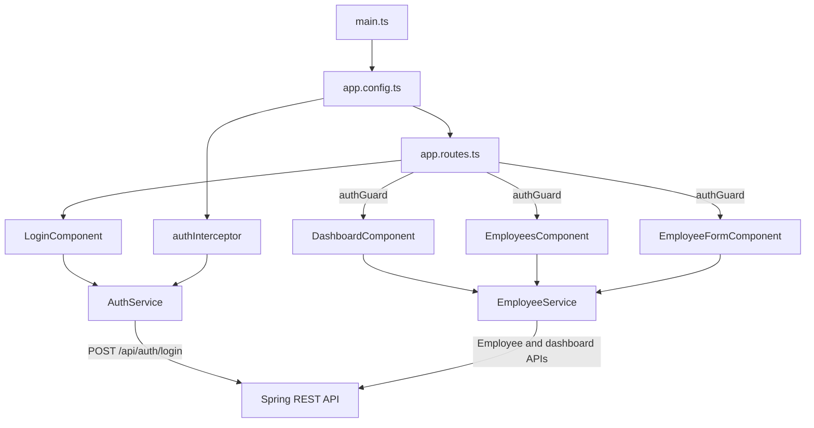

### Frontend Responsibilities

| File or area | Detailed responsibility |
| --- | --- |
| `app.component.ts` | Application shell, navigation, current-user display, logout, role-aware commands |
| `app.routes.ts` | Public login route, guarded application routes, default and wildcard redirects |
| `core/auth.service.ts` | Login request, token/user persistence, logout, authentication state, role checks |
| `core/auth.guard.ts` | Redirect unauthenticated navigation to `/login` |
| `core/auth.interceptor.ts` | Add bearer token to outgoing API requests |
| `core/employee.service.ts` | Employee CRUD/search and dashboard HTTP calls |
| `core/models.ts` | TypeScript API request and response contracts |
| `pages/login/` | Credential form and authentication feedback |
| `pages/employees/` | Search, filters, sort, page state, role-aware actions, deletion confirmation |
| `pages/employee-form/` | Shared create/edit form, client validation, save feedback |
| `pages/dashboard/` | Summary loading, metrics, currency rows, organizational distribution |

### Route Table

| Route | Component | Guard |
| --- | --- | --- |
| `/login` | `LoginComponent` | Public |
| `/dashboard` | `DashboardComponent` | `authGuard` |
| `/employees` | `EmployeesComponent` | `authGuard` |
| `/employees/new` | `EmployeeFormComponent` | `authGuard` |
| `/employees/:id/edit` | `EmployeeFormComponent` | `authGuard` |
| `/` and unknown routes | Redirect to `/dashboard` | Guard applies after redirect |

## Backend Design

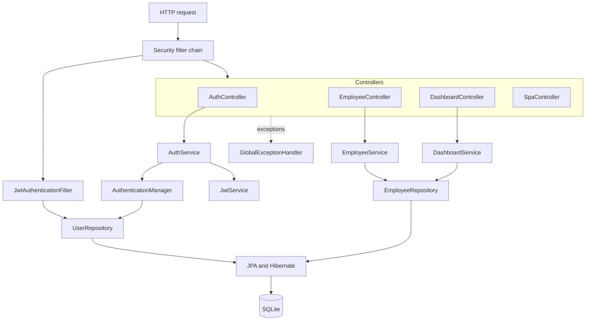

### Backend Package Responsibilities

| Package | Main types | Detailed responsibility |
| --- | --- | --- |
| `auth` | `AuthController`, `AuthService`, auth DTOs | Authenticate credentials and issue token/user response |
| `security` | `JwtService`, `JwtAuthenticationFilter` | Sign, parse, validate JWTs and establish request authentication |
| `config` | `SecurityConfig`, `CorsConfig` | Password encoder, authentication provider, route policy, CORS |
| `user` | `AppUser`, `Role`, `UserRepository` | Persist login identities and authorities |
| `employee` | Entity, DTOs, controller, service, repository | Employee CRUD, uniqueness, search, paging, aggregate queries |
| `dashboard` | Controller, service, metric DTOs | Build the organization summary from repository projections |
| `common` | `ApiError`, `PageResponse`, exceptions, advice | Stable paging and mapped error responses |
| `seed` | `DataInitializer` | Idempotent demo users and conditional employee seed |
| `web` | `SpaController` | Forward browser routes to Angular `index.html` |

## API Contracts

All business APIs use JSON. Protected calls require `Authorization: Bearer <token>`.

| Method and path | Access | Success | Main failures |
| --- | --- | --- | --- |
| `POST /api/auth/login` | Public | `200` token and user | `400`, `401` |
| `GET /api/employees` | Authenticated | `200` paged employees | `401` |
| `GET /api/employees/{id}` | Authenticated | `200` employee | `401`, `404` |
| `POST /api/employees` | `ADMIN`, `HR_MANAGER` | `201` employee | `400`, `401`, `403`, `409` |
| `PUT /api/employees/{id}` | `ADMIN`, `HR_MANAGER` | `200` employee | `400`, `401`, `403`, `404`, `409` |
| `DELETE /api/employees/{id}` | `ADMIN` | `204` | `401`, `403`, `404` |
| `GET /api/dashboard/summary` | Authenticated | `200` summary | `401` |
| `GET /actuator/health` | Public | `200` health state | Platform/runtime failures |

`GET /api/employees` accepts `search`, `country`, `department`, `active`, `page`, `size`, and Spring `sort` parameters. The response contains `content`, `page`, `size`, `totalElements`, and `totalPages`.

OpenAPI details are maintained in the feature contracts:

- [Identity API](../specs/001-identity-access/contracts/auth-api.yaml)
- [Employee API](../specs/002-employee-records/contracts/employees-api.yaml)
- [Dashboard API](../specs/003-compensation-insights/contracts/dashboard-api.yaml)

## Persistence Model

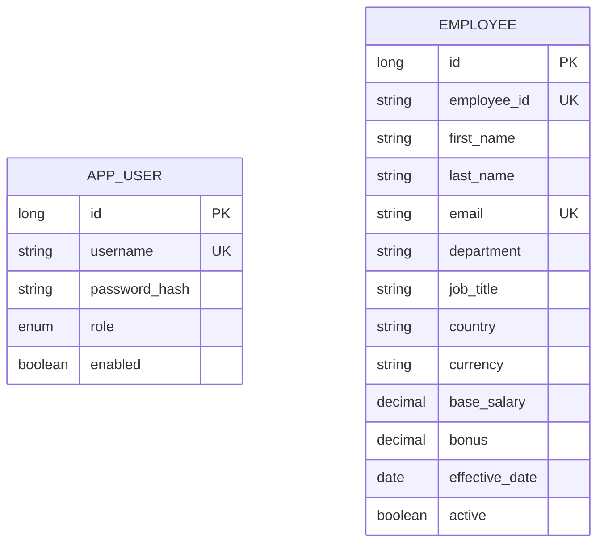

Users authorize access but do not own employee rows, so there is no foreign-key relationship between the two entities. Hibernate manages the demo schema using `ddl-auto: update`.

### Employee Validation

| Field | Constraint |
| --- | --- |
| `employeeId` | Required, unique, maximum 30 characters |
| `firstName`, `lastName` | Required, maximum 80 characters |
| `email` | Required, valid email, unique, maximum 160 characters |
| `department` | Required, maximum 100 characters |
| `jobTitle` | Required, maximum 120 characters |
| `country` | Required, maximum 80 characters |
| `currency` | Exactly three uppercase letters |
| `baseSalary`, `bonus` | Required, non-negative, maximum 13 integer and 2 fractional digits |
| `effectiveDate` | Required, past or present |
| `active` | Required boolean |

## Authentication Sequence

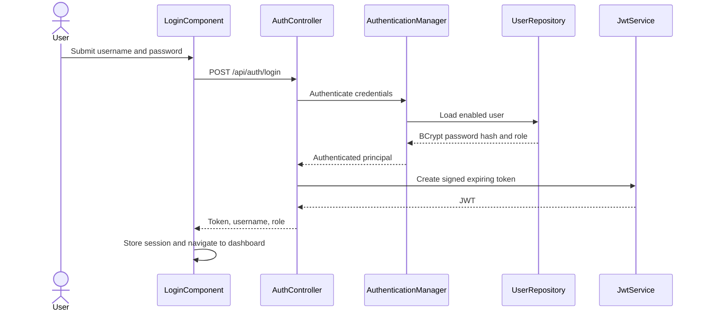

For later requests, the Angular interceptor attaches the token. `JwtAuthenticationFilter` validates its signature and subject, reloads the user, and places authorities into the Spring Security context before controller and method authorization.

## Employee Query Sequence

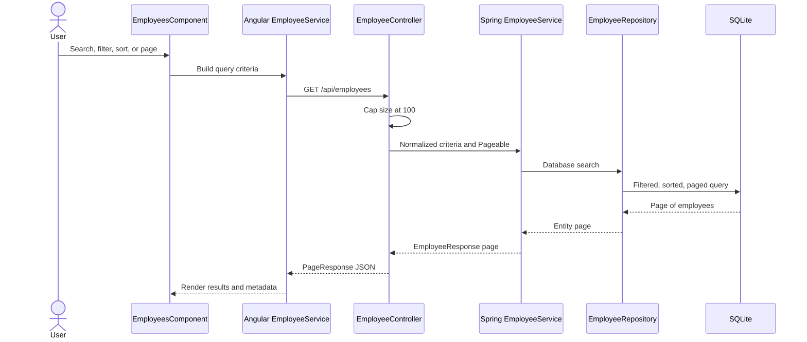

Search performs case-insensitive contains matching over employee ID, first name, last name, email, and job title. Country, department, and active are exact optional filters.

## Employee Write Sequence

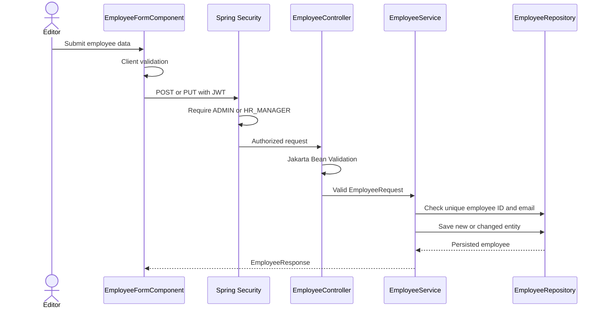

Deletion follows the same boundary but requires `ADMIN`, loads the target to establish existence, and returns `204` after deletion.

## Dashboard Aggregation Sequence

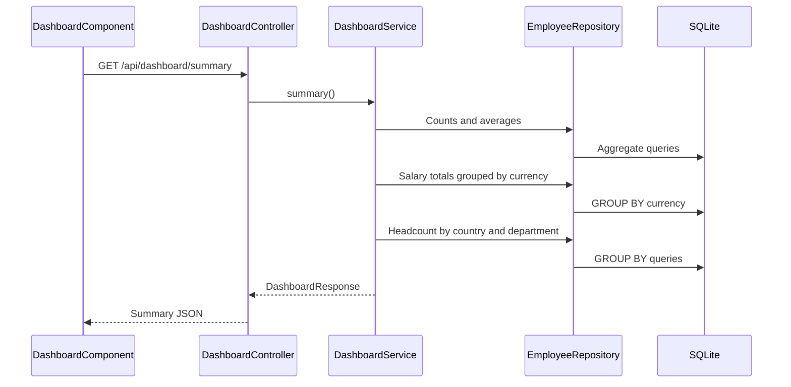

The service executes seven aggregate repository operations: total count, active count, two averages, currency totals, country counts, and department counts. Empty averages become zero. Currency totals are never combined; global averages are labeled as unconverted local currency units.

## Error Handling

`GlobalExceptionHandler` maps domain and validation failures into `ApiError`:

```json
{
  "timestamp": "2026-09-27T12:00:00Z",
  "status": 400,
  "message": "Validation failed",
  "validationErrors": {
  "email": "must be a well-formed email address"
  }
}
```

| Exception | Status | Behavior |
| --- | --- | --- |
| `MethodArgumentNotValidException` | `400` | Field errors included |
| `BadCredentialsException` | `401` | Generic credential message |
| `ResourceNotFoundException` | `404` | Resource message |
| `DuplicateResourceException` | `409` | Duplicate employee ID/email message |

Spring Security handles authentication and authorization failures before controller advice, so `401` and `403` bodies from that boundary are not guaranteed to use `ApiError`.

## Startup and Seed Lifecycle

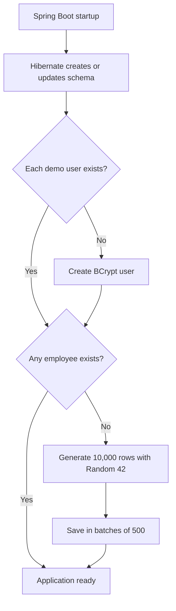

Employee IDs range from `ACME-00001` to `ACME-10000`. Country and currency are paired deterministically. Existing employee data suppresses the employee seed, while each missing demo user is restored independently.

## Runtime Configuration

| Variable | Default | Purpose |
| --- | --- | --- |
| `PORT` | `8080` | HTTP port |
| `DB_PATH` | `salary.db` | SQLite file path |
| `CORS_ORIGINS` | `http://localhost:4200` | Allowed API browser origin |
| `JWT_SECRET` | Demo fallback | Token signing secret; must be overridden outside local demo |
| `JWT_EXPIRATION_MS` | `7200000` | Token lifetime |

Actuator exposes `health` and `info`; health probes are enabled. Jackson omits null values. JPA open-session-in-view is disabled, and Hibernate orders batched inserts and updates.

## Test Architecture

Backend unit and security tests cover authentication, JWT subject handling, employee duplicate/mapping/filter behavior, currency separation, and public-versus-protected routes. Frontend service tests cover authentication session storage and employee query parameter construction.

Component, controller contract, seed lifecycle, complete authorization-matrix, and deployed-container smoke tests remain valuable coverage extensions. See each feature's `quickstart.md` and `tasks.md` for traceability.

## Known Constraints and Evolution Path

| Current constraint | Production evolution |
| --- | --- |
| SQLite single-file persistence | Managed PostgreSQL and versioned migrations |
| Render `/tmp` data loss | Durable managed storage and backup/restore |
| Seeded demo identities | Managed identity, SSO/MFA, provisioning, password lifecycle |
| Session-storage JWT | Threat-modelled token storage, refresh/revocation strategy |
| No audit trail | Immutable employee and compensation change audit |
| Sequential dashboard queries | Measured query optimization, caching, or consolidated projections |
| Leading-wildcard search | Database-specific search indexes or dedicated search capability |
| One application instance | Stateless scaling backed by shared durable services |

Any evolution starts by updating the relevant feature specification and then running the Spec Kit plan, tasks, implementation, and convergence workflow.
